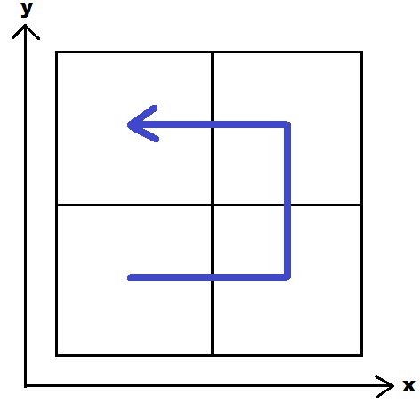

= Quad Tree

Dörtlü ağaç, dörde bölünmüş bir yüzey hakkında bilgi depolayan bir veri yapısıdır. 2 boyutlu bir alanı yenilemeli bir şekilde dört bölüme ayırmak için kullanılır.

*  Görüntü işleme
*  Mekansal indeksleme
*  İki boyutta etkili  çarpışma algılama

gibi alanlarda kullanılır.

*_ANAHTAR KELİMELER_*

Düğüm:: 
Alt uzayı gösteren alandır. Her düğüm, dört alt düğümden oluşur
(yaprak düğüm hariç)

Kök Düğüm::
Tüm alanı gösteren ağacın en tepesindeki düğümdür.

Yaprak Düğüm::
Bölünebilecek en küçük alt alanı gösteren ağacın en
ucundaki düğümdür. Çocuk düğümü yoktur.

Ebeveyn Düğüm::
Alt alanı gösteren düğümün içinde bulunduğu üst alanı
gösteren düğümdür. Her alt alan bir ebeveyn düğüme bağlıdır (kök düğüm
hariç).

Çocuk Düğüm::
Üst alanı gösteren ebeveyn düğümün dört alt uzayından
birisini gösteren düğümdür. Bu düğüm quadrant olarak adlandırılır.

Seviye / Derinlik::
Çözünürlüğe bağlı olarak ağacın alt alanlara bölünme sayısıdır.

Dolanım yönü::
Ağacın, çocuk düğümleri ziyaret etme sırasıdır. Ağaç
oluşturulmadan önce eksenlerin dolaşılacağı sıraya göre belirlenen bu yön,
ağacın her seviyesinde aynıdır.

Örneklerimizde dolanım yönü figure 1'de gösterildiği şekilde olacaktır.

.Örnek
Veriler sırasıyla xy koordinatı şeklinde alınmıştır. 

Dolu alanları koordinatları: (2,2),(6,2),(5,5),(7,5),(7,7),(1,5),(3,5)

Boş alanların koordinatları: (5,7),(3,7),(1,7)

image::ornek.JPG[title="Orjinal şekil"]
Orjinal şekil figure 2'de gösterilmiştir.

image::ızgara.JPG[title="Orjinal şeklin ızgaralı hali"]
Figure 3, orjinal şeklin yinelemeli olarak dörde bölünmüş halidir.

.Algoritma

* Eğer alan doluysa dörde böl. Orda bulunan noktayı ve elimizdeki noktayı tekrar yolla.
* Eğer alan boşsa yerleştir.

image::koordinat.JPG[title="Orjinal şeklin koordinatları"]
Firgure 4'te ise şekli koordinatlarıyla birlikte görebilirsiniz.

image::agac.JPG[title="Orjinal şeklin quad tree hali"]
Figure 5'teki quad tree derinliği ile birlikte verilmiştir.

= Düğüm Üstünden Quad Tree Oluşturma

İlk verileni kök kabul edip ilerleyen quad treedir.

.Algoritma
* *Eğer kök=nullsa kök, gönderilen düğüm olacak*
* *Değilse gönderilen düğümün x ve y değerleri parentlarının x y değerlerine göre uygun bölgeye konur. Uygun bölgeyi bulduğumuzu ise ulaşılan değerin null olmasından anlayacağız.*

.Data
[source,]
----
int x, y;
Dugum cocuklar[] = new Dugum[4];
----

.Kod

[source,java]
----
public void dugumEkle(int x, int y) {

        Dugum yeniDugum = new Dugum(x, y);
        if (kok == null) {   //kök yoksa köke ata
            kok = yeniDugum;
        } else {
            Dugum odaklananDugum = kok;
            Dugum aile;
            while (true) {  //eklememiz gereken yeri bulmak için
                aile = odaklananDugum;

                if (x < odaklananDugum.x && y < odaklananDugum.y) { //günaybatı
                    odaklananDugum = odaklananDugum.cocuklar[0];    
                    if (odaklananDugum == null) {
                        aile.cocuklar[0] = yeniDugum;
                        return;
                    }
                } else if (x >= odaklananDugum.x && y < odaklananDugum.y) { //günaydoğu
                    odaklananDugum = odaklananDugum.cocuklar[1];
                    if (odaklananDugum == null) {
                        aile.cocuklar[1] = yeniDugum;
                        return;
                    }
                } else if (x >= odaklananDugum.x && y >= odaklananDugum.y) { //kuzeydoğu
                    odaklananDugum = odaklananDugum.cocuklar[2];
                    if (odaklananDugum == null) {
                        aile.cocuklar[2] = yeniDugum;
                        return;
                    }
                } else {                                                    //kuzeybatı
                    odaklananDugum = odaklananDugum.cocuklar[3];
                    if (odaklananDugum == null) {
                        aile.cocuklar[3] = yeniDugum;
                        return;
                    }
                }
            }

        }
    }
----

= Girdileri Belli Olan Quad Tree 
Girdiler arasında en büyük ve en küçük x ve y değerleri bulunur. En büyük x ve en küçük x değerini toplayıp ikiye böldüğümüzde orta x değerine ulaşırız. Aynı şekilde orta y değerine de ulaşırız. Derinlik i değişkeninde tutulur ve ilk değeri sıfırdır ve değişken i =i+2 şeklinde artar.

.Algoritma
* *Eğer kök=nullsa kök, gönderilen düğüm olacak*
* *Eğer kök null değilse ve gönderilmek istenen yer dolu ise dörde böl. Kısmen dolu yeri oranın orta x ve orta y değeri olacak.*
* *Eğer kök null değilse ve gönderilmek istenen yer boşsa yerleştir.* 

Figure 1'de belirtilen yön doğrultusunda;

*1)* (ortaX-ortaX/i,ortaY-ortaY/i)

*2)* (ortaX+ortaX/i,ortaY-ortaY/i)

*3)* (ortaX+ortaX/i,ortaY+ortaY/i)

*4)* (ortaX-ortaX/i,ortaY+ortaY/i)

.Data
[source,]
----
int x, y;
Dugum cocuklar[] = new Dugum[4];
----

