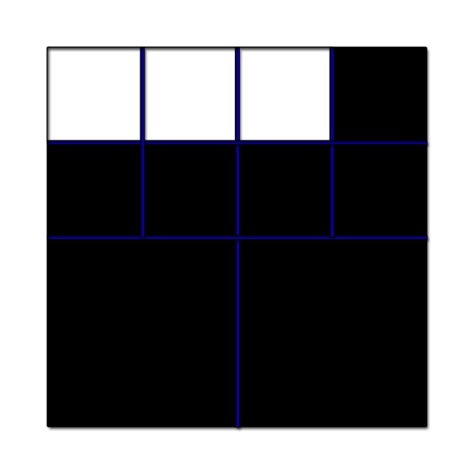
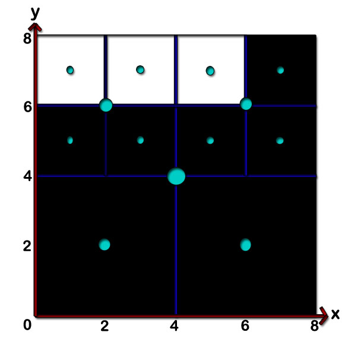
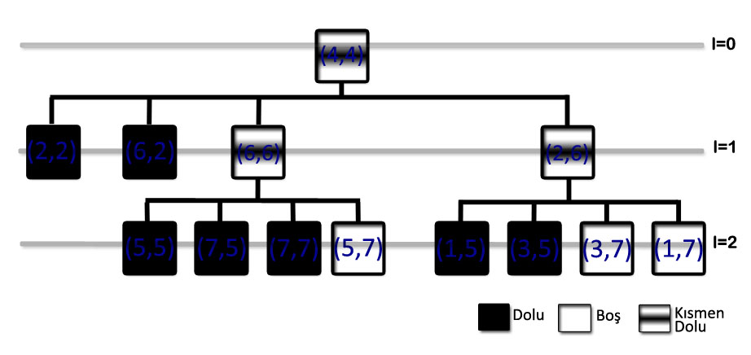

= Quad Tree

Dörtlü ağaç, dörde bölünmüş bir yüzey hakkında bilgi depolayan bir veri yapısıdır. 2 boyutlu bir alanı yenilemeli bir şekilde dört bölüme ayırmak için kullanılır.

*  Görüntü işleme
*  Mekansal indeksleme
*  İki boyutta etkili  çarpışma algılama

gibi alanlarda kullanılır.

*_ANAHTAR KELİMELER_*

* *Düğüm:* 
Alt uzayı gösteren alandır. Her düğüm, dört alt düğümden oluşur
(yaprak düğüm hariç)

* *Kök Düğüm:*
Tüm alanı gösteren ağacın en tepesindeki düğümdür.

* *Yaprak Düğüm:*
Bölünebilecek en küçük alt alanı gösteren ağacın en
ucundaki düğümdür. Çocuk düğümü yoktur.

* *Ebeveyn Düğüm:*
Alt alanı gösteren düğümün içinde bulunduğu üst alanı
gösteren düğümdür. Her alt alan bir ebeveyn düğüme bağlıdır (kök düğüm
hariç).

* *Çocuk Düğüm:* 
Üst alanı gösteren ebeveyn düğümün dört alt uzayından
birisini gösteren düğümdür. Bu düğüm quadrant olarak adlandırılır.

* *Seviye / Derinlik:* 
Çözünürlüğe bağlı olarak ağacın alt alanlara bölünme sayısıdır.

* *Dolanım yönü:* 
Ağacın, çocuk düğümleri ziyaret etme sırasıdır. Ağaç
oluşturulmadan önce eksenlerin dolaşılacağı sıraya göre belirlenen bu yön,
ağacın her seviyesinde aynıdır.

Örneklerimizde dolanım yönü figure 1'de gösterildiği şekilde olacaktır.

image::Dolanım.PNG[title="Dolanım Yönü"]

.Örnek
Veriler sırasıyla xy koordinatı şeklinde alınmıştır. Sadece dolu alanlar verilmiştir. Koordinatlar şu şekildedir: (2,2),(6,2),(5,5),(7,5),(7,7),(1,5),(3,5)

image::ornek.JPG[title="Orjinal şekil"]
Orjinal şekil figure 2'de gösterilmiştir.

Figure 3, orjinal şeklin yinelemeli olarak dörde bölünmüş halidir. Yinelemeli olarak dörde bölme işlemi şu şekide gerçekleşiyor:

* Alan dolu mu, boş mu?
* Eğer alan kısmi doluysa dörde böl

Firgure 4'te ise şekli koordinatlarıyla birlikte görebilirsiniz.

